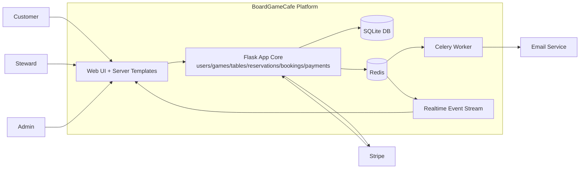

# BoardGameCafe Block Diagram Structure (Implementation Blueprint)

Use this as the source of truth for your new block diagram.

## 1) Diagram objective

Your diagram should explain:
- Who interacts with the system (Customer, Steward, Admin, external providers).
- What the major runtime blocks are.
- How booking, payment, seating, admin policy, and realtime updates move through the system.
- Where domain rules are enforced.

Keep this as a C4-style hybrid:
- Level A: Context (actors + external systems).
- Level B: Container/runtime architecture.
- Level C: Core domain flow blocks (booking lifecycle).

---

## 2) Level A: System Context (outermost)

### Actors
- Customer
- Steward
- Admin

### External systems
- Stripe (payment checkout + webhook)
- Email provider (notifications)

### Main system boundary
- BoardGameCafe Platform

### Required context arrows
- Customer -> Platform: browse games, auth, bookings, my bookings, ratings
- Steward -> Platform: day operations, booking changes, seating/completion, incidents
- Admin -> Platform: steward management, game/table management, fee/policy management, reports
- Platform -> Stripe: create checkout session for booking payment
- Stripe -> Platform: webhook payment result (success/fail)
- Platform -> Email provider: booking/account notifications

---

## 3) Level B: Container/Runtime Diagram (inside platform)

Draw one big BoardGameCafe boundary, then these containers:

1. Web UI + Server-side templates
- Public/customer pages
- Steward pages
- Admin pages
- Auth pages

2. Flask Application Core
- Route layer (UI pages + REST endpoints)
- Feature modules:
  - users
  - games
  - tables
  - reservations
  - bookings
  - payments
- Application services/use cases
- Domain rules and validation
- Event publishing

3. Primary Data Store
- SQLite DB (users, bookings, booking lines, table reservations, game reservations, payments, incidents, policies/config)

4. Redis
- Broker/result backend for async jobs
- Realtime event channel for steward updates

5. Celery Worker
- Async event handlers/tasks
- Notification and background processing

6. External Payment Provider
- Stripe checkout
- Stripe webhook callback

7. Email Service
- Outbound booking/account emails

### Required container arrows
- Web UI <-> Flask Core: HTTP requests/responses
- Flask Core <-> SQLite: transactional reads/writes
- Flask Core -> Stripe: create payment intent/session
- Stripe -> Flask Core: webhook status update
- Flask Core -> Redis: publish domain/realtime events
- Celery Worker <-> Redis: consume async tasks/events
- Celery Worker -> Email Service: send emails
- Steward UI <- Flask Core realtime stream fed by Redis events

---

## 4) Level C: Core Booking Lifecycle Blocks (critical domain flow)

Represent as ordered blocks with decision diamonds.

1. Customer starts booking
- Input: party size + time
- System suggests table(s)

2. Table selection validation
- Rule: selected table capacity must be >= party size
- If invalid: block booking and show error

3. Game copy selection
- Rule: maximum 10 reserved copies

4. Price calculation
- Rule source: admin-managed fee/policy configuration + discounts

5. Create booking draft/finalize request
- On Book now: save booking status = created (plus selected reservations)

6. Redirect to Stripe checkout

7. Payment result decision
- Success path:
  - mark booking as paid
  - publish booking created/paid event
  - send confirmation and show confirmation page
- Failure path:
  - delete booking aggregate and related reservations/payment entries
  - return user to safe state with failure message

8. Post-payment operations
- Customer views my bookings (read only)
- Steward may modify booking later (customer cannot)

Use color/style to distinguish:
- Validation rules (orange)
- Transactional state writes (blue)
- External integration (green)
- Async/realtime events (teal)

---

## 5) Steward Operations Subdiagram

Blocks:
- Steward login
- Dashboard for selected date (default today)
- Booking state lanes:
  - upcoming
  - seated
  - completed
  - overdue/no-show risk and overtime seated
- Floorplan + table status view
- Modify booking on request (may add fees)
- Mark seated/completed
- Create game incident (lost/damaged)
- Publish realtime updates to other stewards

Rules to annotate:
- Steward is the only role allowed to operationally modify created bookings.
- Realtime updates synchronize multiple steward sessions.

---

## 6) Admin Operations Subdiagram

Blocks:
- Admin login (no self-registration)
- Force password reset on first login
- Steward lifecycle management:
  - create steward
  - delete steward
  - force steward password reset
- Customer governance:
  - suspend customer
- Catalog management:
  - add/update/remove games
  - manage game copies, tags, descriptions
- Venue management:
  - add/update/remove tables
  - floor and floorplan setup
- Policy/fee management:
  - pricing configuration
  - cancellation windows
  - discount rules
- Reporting:
  - read-only CSV exports

Rules to annotate:
- Admin configuration directly affects booking price calculation logic.
- Admin has management authority; customer/self-service boundaries remain strict.

---

## 7) Domain rule annotations to place directly on diagram

Place short rule tags near relevant blocks:
- R1: Customer must be logged in to submit ratings.
- R2: Table capacity cannot be smaller than party size.
- R3: Max 10 game copies per booking.
- R4: Booking created before payment; paid only after successful webhook/confirmation.
- R5: Payment failure triggers cleanup of booking + reservations + payment entries.
- R6: Customer cannot edit booking after creation; steward handles modifications.
- R7: Admin-controlled policy and discounts drive pricing.

---

## 8) Layout recommendation (for readability)

Use three horizontal zones:
- Top: Actors (Customer, Steward, Admin) and External systems (Stripe, Email)
- Middle: Web/UI and Flask Core feature blocks
- Bottom: Data/infra (SQLite, Redis, Celery Worker)

Keep arrow direction mostly left-to-right:
- Actor -> UI -> App Core -> Data/External -> Events/Notifications

Use one legend box:
- Solid arrow = synchronous HTTP/DB call
- Dashed arrow = async event/task
- Diamond = business decision/validation

---

## 9) Minimal first version (what to draw first)

If you want a quick first pass, draw these only:
- Actors: Customer, Steward, Admin
- Containers: UI, Flask Core, SQLite, Redis, Celery, Stripe
- Critical flow: booking create -> Stripe -> webhook success/fail -> paid or cleanup
- Steward realtime updates and admin policy management arrows

Then iterate by adding subdiagram detail.

---

## 10) Optional Mermaid starter (container view)

Use this only as a structural scaffold, then add your domain rule labels and role-specific subflows.
